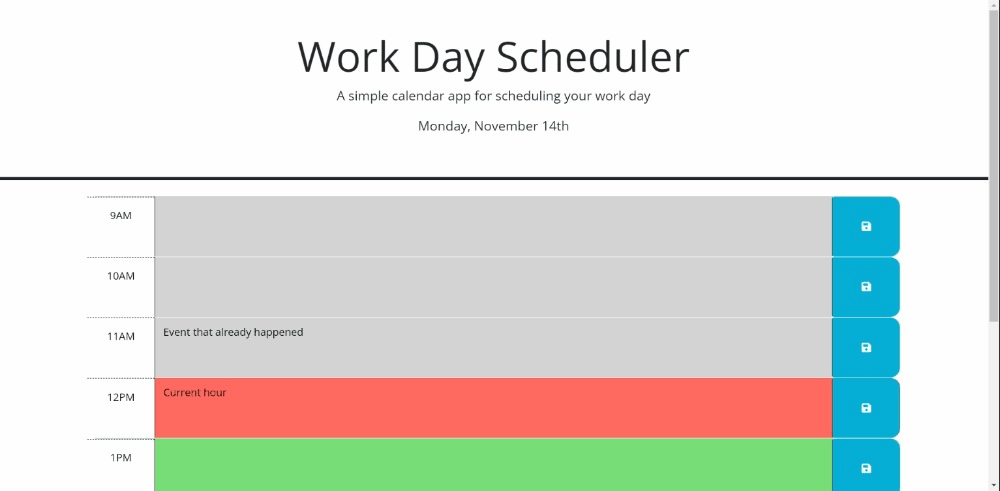

# third-party-apis-work-day-scheduler
Work Day Scheduler

## Description

An application that enables a user to create a simple calendar application that is able to save events for each hour of the day. This app will run in the browser and feature dynamically updated HTML and CSS powered by jQuery.

## Installation

N/A

## Usage
Current date is displayed at the top of the calendar, and everything saved in local storage will be cleared by the start of a new day. The timeblocks displays schedules for standard business hours, and each timeblock is color coded to indicate whether it is in the past, present, or future. The colors are dynamically updated each hour without the need to refresh the page. To create a schedule in this daily planner, click into a timeblock in order to enter an event, and click the save button to save the text in local storage. The saved events persist even if the page is refreshed within the same day.

## Screenshot

The following image shows the web application's appearance and functionality:

## Link

[Deploy Link to the web application](https://m1xzo.github.io/05chl-third-party-apis-work-day-scheduler/).

## Credits

N/A

## License

Please refer to the LICENSE in the repo.
